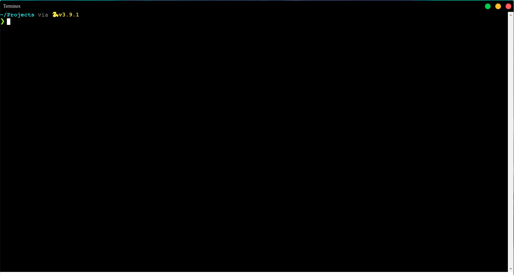

# TERMINEX



## What Is Terminex

Terminex is a intuitive, simple and cross-platform terminal made using JS.

### Installation

- Start by cloning the project from GitHub.

```terminal
git clone https://github.com/katungi/terminex.git
```

cd into the directory:

If you are on windows, run the `.bat` file by right clicking it and **_running as administrator_**

If you are running a linux distro, you will need to give the file permissions by running:

```terminal
chmod 744 npm_install.sh
```

then run it:

```terminal
./npm_install.sh
```

This will install all the dependencies you need to run the terminal.

### Running The Terminal

Once the dependencies are installed, run:

```terminal
npm start

```

## Built With

- [Visual Studio Code](https://visualstudio.microsoft.com/downloads/) - Development Environment
- [Electron JS](https://www.electronjs.org/) - Development Tool
- [Hyper](https://hyper.is/) - Inspiration for the project
- [HTML/CSS](https://developer.mozilla.org/en-US/docs/Web/HTML) - UI development
- Love - Key ingredient (Naah, Just Kidding, It's JS)

## Contributing

Please read [CONTRIBUTING.md](https://gist.github.com/PurpleBooth/b24679402957c63ec426) for details on our code of conduct, and the process for submitting pull requests to us.

If you have **_Any_** ideas about the project, Feel free to open an issue. I have no life so I will respond almost immediately.

## Author

**Daniel Dennis** - _Initial work_ - [Other Works](https://github.com/katungi/)

See also the list of [contributors](https://github.com/your/project/contributors) who participated in this project.

## License

This project is licensed under the MIT License - see the [LICENSE.md](LICENSE.md) file for details
